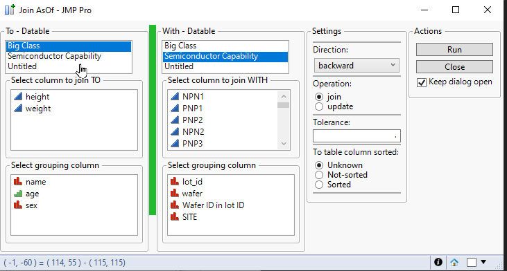

# Join Nearest Columns

Join two datatables with continuous column. Can do join backwards, forwards, nearest/closest. Data doesn't have to be sorted but it does speed up the tool execution. Inspiration partially from [Python Pandas - Merge Asof](https://pandas.pydata.org/docs/reference/api/pandas.merge_asof.html) 

# Startup
